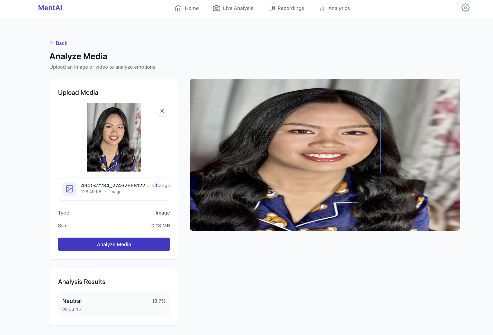
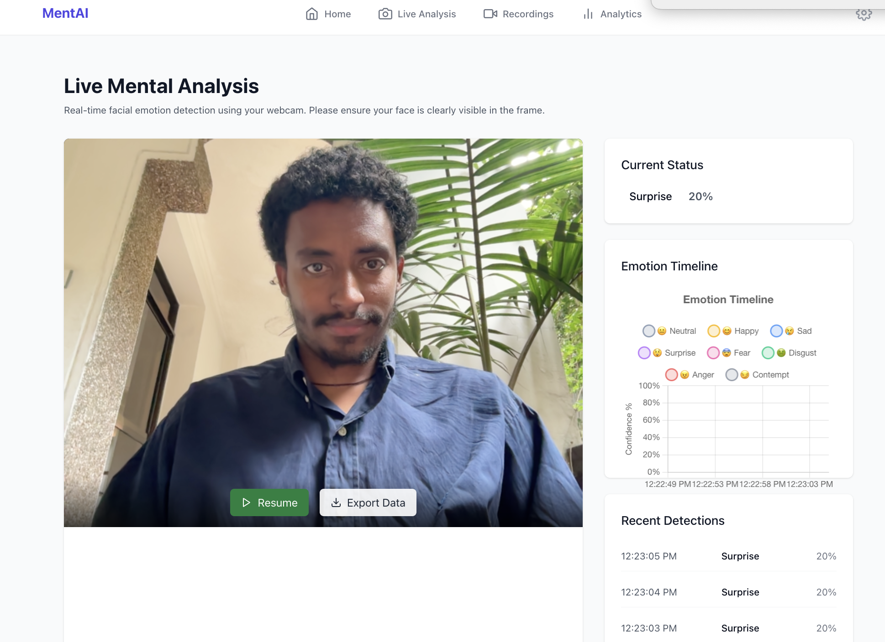

# Mental Health Recognition App

**Thesis Project – “Predicting Mental Health Risks in Remote Workers Using Image-Based Machine Learning Models”**

This full-stack web application provides an interactive dashboard for real-time facial emotion recognition.  It supports academic research by capturing, analysing, and exporting emotion data from remote workers’ facial expressions so that it can be correlated with psychological survey scores (PHQ-9, PSS-10, etc.).

A full-stack web application for real-time facial emotion recognition using deep learning, designed to support mental health research.

## Features

- Real-time facial emotion detection from webcam or uploaded videos
- Emotion prediction using a pre-trained EMO-AffectNet model
- Facial landmark detection with Dlib
- Interactive emotion timeline visualization
- Data export functionality (CSV)
- Responsive and modern UI

## Demo

### Analyze Media Page


### Live Webcam Detection


## Tech Stack

### Backend
- Python 3.8+
- FastAPI
- OpenCV
- Dlib
- PyTorch (TorchScript)
- WebSockets for real-time communication

### Frontend
- Next.js 13 with TypeScript
- TailwindCSS for styling
- Chart.js for data visualization
- WebRTC for camera access

## Prerequisites

- Python 3.8 or higher
- Node.js 16.x or higher
- pip (Python package manager)
- npm or yarn

## Setup Instructions

### 1. Clone the repository

```bash
git clone <repository-url>
cd emotion-recognition-app
```

### 2. Backend Setup

1. Create and activate a virtual environment:
   ```bash
   cd backend
   python -m venv venv
   source venv/bin/activate  # On Windows: venv\Scripts\activate
   ```

2. Install Python dependencies:
   ```bash
   pip install -r requirements.txt
   ```

3. Download the required models:
   - Place your TorchScript model (e.g., `torchscript_model_0_66_49_wo_gl.pth`) in `backend/models/`
   - Download the Dlib shape predictor file (68 face landmarks) and place it in `backend/models/`

### 3. Frontend Setup

1. Navigate to the frontend directory:
   ```bash
   cd ../frontend
   ```

2. Install Node.js dependencies:
   ```bash
   npm install
   # or
   yarn install
   ```

## Running the Application

### 1. Start the Backend

From the `backend` directory:

```bash
uvicorn app.main:app --reload
```

The API will be available at `http://localhost:8000`

### 2. Start the Frontend

From the `frontend` directory:

```bash
npm run dev
# or
yarn dev
```

The application will be available at `http://localhost:3000`

## Usage

1. Open the application in your web browser
2. Choose between live camera or video upload mode
3. Allow camera access if prompted
4. View real-time emotion detection and analysis
5. Use the export button to download emotion data as CSV

## Project Structure

```
emotion-recognition-app/
├── backend/                    # Backend server
│   ├── app/
│   │   ├── api/               # API routes
│   │   ├── core/              # Core configuration
│   │   ├── models/            # ML models
│   │   ├── services/          # Business logic
│   │   └── utils/             # Utility functions
│   ├── tests/                 # Backend tests
│   ├── requirements.txt        # Python dependencies
│   └── main.py                # FastAPI application entry point
│
├── frontend/                  # Frontend application
│   ├── public/                # Static files
│   ├── src/
│   │   ├── app/             # Next.js app directory
│   │   ├── components/        # React components
│   │   └── styles/            # Global styles
│   ├── package.json           # Node.js dependencies
│   └── tsconfig.json          # TypeScript configuration
│
└── README.md                 # This file
```

## Troubleshooting

1. **Dlib installation issues**:
   - On macOS: `brew install cmake`
   - On Ubuntu: `sudo apt-get install cmake`
   - Then reinstall dlib: `pip install dlib --force-reinstall --no-cache-dir`

2. **Webcam access issues**:
   - Ensure your browser has camera permissions
   - Try accessing the app via `https://` or `http://localhost`

3. **Model loading errors**:
   - Verify the model files are in the correct location
   - Check the model file paths in `backend/app/core/config.py`

## License

This project is licensed under the MIT License - see the [LICENSE](LICENSE) file for details.

## Acknowledgments

- EMO-AffectNet for the pre-trained emotion recognition model
- Dlib for facial landmark detection
- The open-source community for the amazing libraries used in this project
